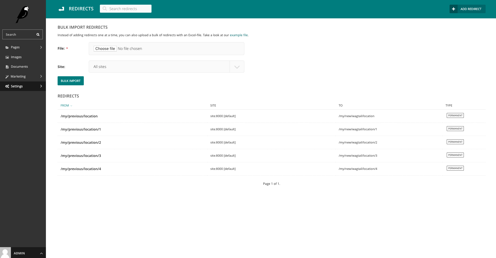

# Features

At the moment the Wagtail Marketing Add-ons consist two main features:

* Page listing to see how you SEO is configured;
* A bulk import feature for configuring redirects;

## SEO Listing

The SEO Listing within the `wagtail-marketing-addons` will show: 

* An overview of all pages in a single list;
* Relevant properties: page title, SEO title, search description;
* A preview what it could look like in a search engine;
* A basic score indicating how this would perform in terms of word and character count.

## Bulk redirect import

To make the migration of an old site to a Wagtail platform more manageable we have created an bulk import functionality for redirects.
This feature is exposed within the regular Wagtail redirects module. All it expects is an Excel file with an old path and new path defined.

For example:

| Old path                | New path                   |
|-------------------------|----------------------------|
| /my/previous/location   | /my/new/wagtail/location   |
| /my/previous/location/1 | /my/new/wagtail/location/1 |
| /my/previous/location/2 | /my/new/wagtail/location/2 |
| /my/previous/location/3 | /my/new/wagtail/location/3 |
| /my/previous/location/4 | /my/new/wagtail/location/4 |

