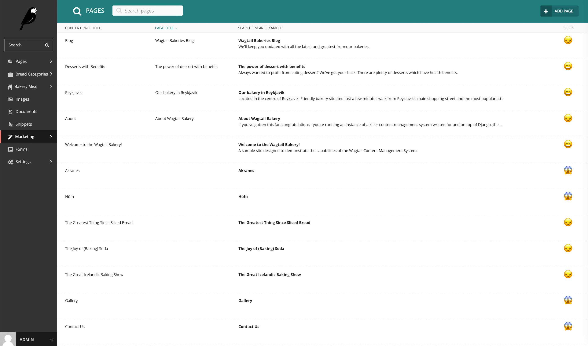

# Features

At the moment the Wagtail Marketing Add-ons consist two main features:

* Page listing to see how you SEO is configured;
* A bulk import feature for configuring redirects;

## SEO Listing

The SEO Listing within the `wagtail-marketing-addons` will show: 

* An overview of all pages in a single list;
* Relevant properties: page title, SEO title, search description;
* A preview what it could look like in a search engine;
* A basic score indicating how this would perform in terms of word and character count.

